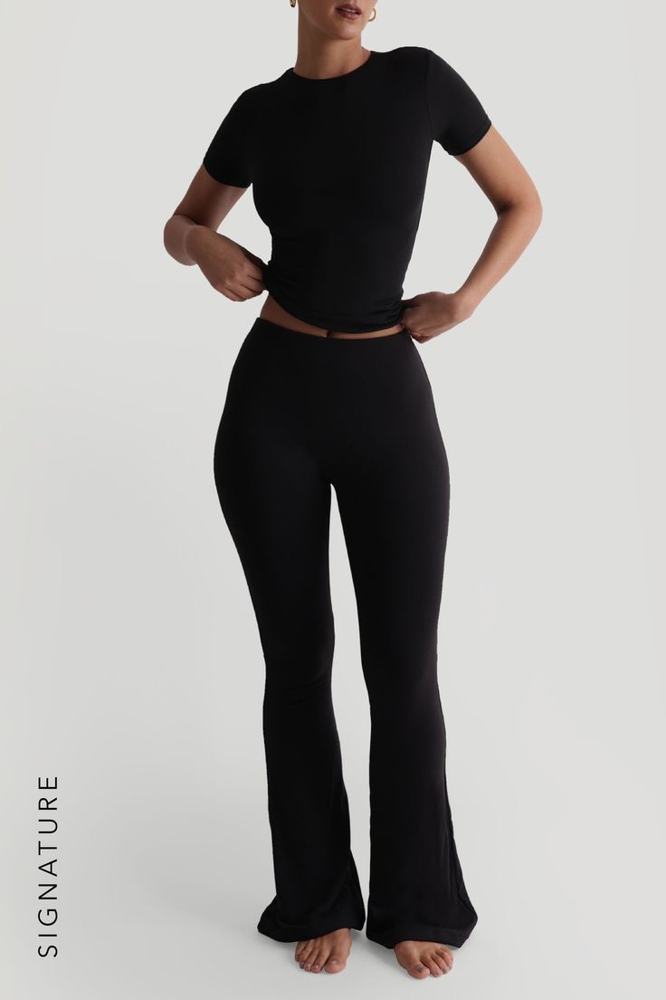
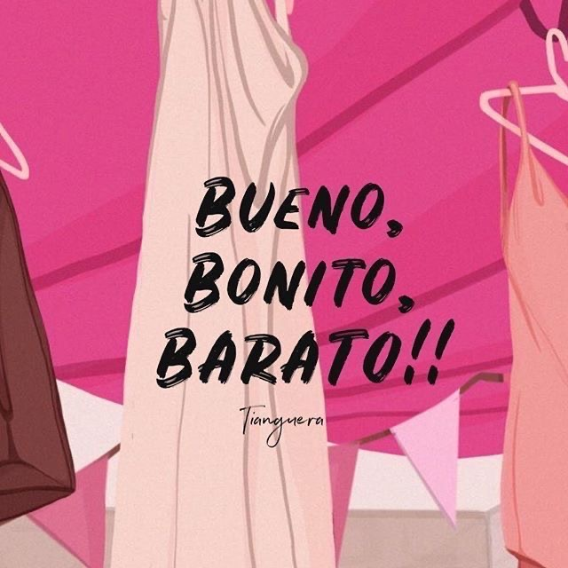

<!DOCTYPE html>
<html lang="es">
<head>
  <meta charset="UTF-8">
  <meta name="viewport" content="width=device-width, initial-scale=1.0">
  <title>Estilo by Nerea | Inicio</title>
  <link href="https://cdn.jsdelivr.net/npm/bootstrap@5.3.3/dist/css/bootstrap.min.css" rel="stylesheet">
  <link rel="stylesheet" href="style.css">
<meta http-equiv="refresh" content="0; url=https://anamorenaherrera06-blip.github.io/ByNerea/">

</head>
<body>

  <header class="hero">
    

      
      <nav class="navbar navbar-expand-md w-100 p-4"> 
        

          
          <h1 class="logo navbar-brand m-0">Estilo by Nerea</h1>
          
          <button class="navbar-toggler" type="button" data-bs-toggle="collapse" data-bs-target="#mainMenu" aria-controls="mainMenu" aria-expanded="false" aria-label="Toggle navigation">
              
          </button>

          

            <ul class="navbar-nav menu">
              <li class="nav-item"><a href="inicio.html" class="nav-link text-white active">Inicio</a></li>
              <li class="nav-item"><a href="galeria.html" class="nav-link text-white">Galería</a></li>
              <li class="nav-item"><a href="tienda.html" class="nav-link text-white">Shop</a></li>
              <li class="nav-item"><a href="sobre-mi.html" class="nav-link text-white">Sobre Nosotros</a></li>
              
            </ul>
          

        

      </nav>

      

        <h2>Explorá Nuestra Última Colección</h2>
        <button type="button" class="btn btn-rosa mt-3" data-bs-toggle="modal" data-bs-target="#modalOferta">
            ¡Quiero mi descuento ahora!
        </button>
      

    

  </header>

  <main class="container my-5">
    <section class="row text-center">
        

            <h3 class="display-6 mb-4 logo">La Moda Eres Tú</h3>
            
Descubre piezas atemporales y las últimas tendencias seleccionadas por Nerea.

        

    </section>

    <section class="row mt-5">
        

            

                
                

                    <h5 class="card-title">Estilo Elegante</h5>
                    
Clásicos modernos para toda ocasión.

                    <a href="galeria.html" class="btn btn-rosa btn-sm">Ver Galería</a>
                

            

        

        

            

                
                

                    <h5 class="card-title">Casual y Cómodo</h5>
                    
Prendas versátiles para tu día a día.

                    <a href="tienda.html" class="btn btn-rosa btn-sm">Ir a Comprar</a>
                

            

        

        

            

                
                

                    <h5 class="card-title">Nuevas Tendencias</h5>
                    
Lo último de la moda directo a tu armario.

                    <button type="button" class="btn btn-rosa btn-sm" data-bs-toggle="modal" data-bs-target="#modalOferta">¡Oferta!</button>
                

            

        

    </section>
  </main>

  

      

          

              

                  <h5 class="modal-title" id="modalOfertaLabel">¡20% de Descuento Exclusivo!</h5>
                  <button type="button" class="btn-close" data-bs-dismiss="modal" aria-label="Close"></button>
              

              

                  
Regístrate y obtén un código de descuento para tu primera compra.

                  <form>
                      <input type="email" class="form-control" placeholder="Ingresa tu email">
                  </form>
              

              

                  <button type="button" class="btn btn-secondary" data-bs-dismiss="modal">Cerrar</button>
                  <a href="tienda.html" class="btn btn-rosa">Ir a la Tienda</a>
              

          

      

  

  <footer class="footer mt-5">
    
© 2025 Estilo by Nerea — Todos los derechos reservados

  </footer>

  
</body>
</html>
